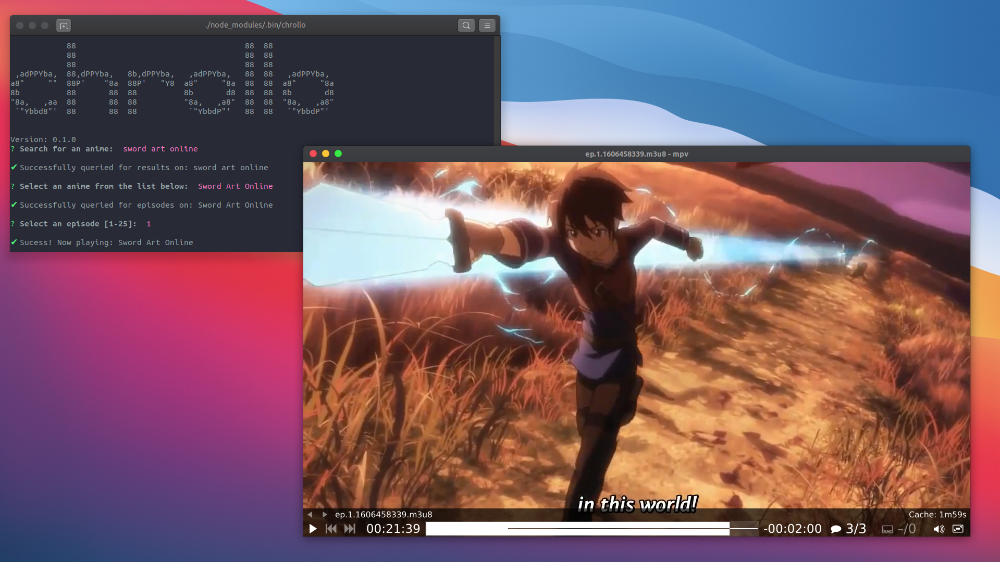

# Chrollo

[](https://www.npmjs.com/package/chrollo)&nbsp;
[](https://opensource.org/licenses/MIT)

> A node.js based CLI to enjoy your favourite anime. Inspired by pystardust's great work (pystardust/ani-cli).

[Requirements](#requirements) |
[Installation](#installation) |
[License](#license)

## Requirements

In order for chrollo to work, `mpv` is required to be installed.

You can follow the steps [here](https://mpv.io/installation/).

## Installation

With [npm](https://npmjs.org/):

```bash
npm install -g chrollo
```

To use chrollo on the command line, install chrollo via npm, then you should be able to run `chrollo` from the command line.

Note: You need **an engine that supports ES6 (e.g. Babel or Node 4.0+)**.

## License

[MIT](http://g14n.info/mit-license)
